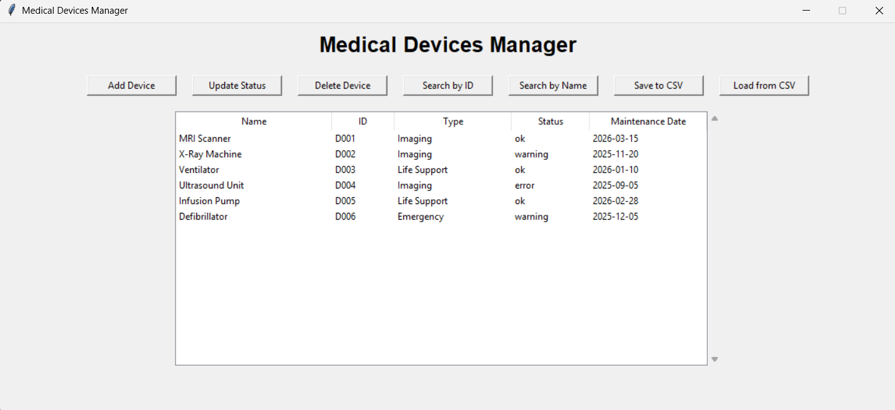
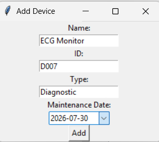
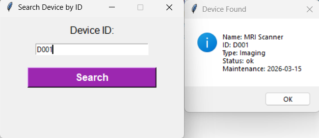
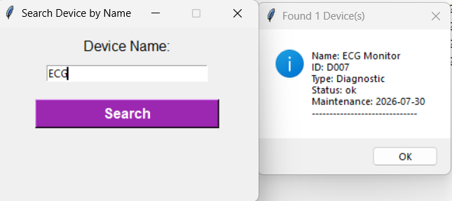

# Medical Devices Manager

A desktop GUI application built with Python and Tkinter for managing medical devices — adding, updating, searching, and tracking their maintenance status. Data can be exported to and imported from CSV files.

## Features

- **Add devices** — register a new device with name, ID, type, and maintenance date
- **Update status** — change a device's status to `ok`, `warning`, or `error`, with every change logged to `log.txt`
- **Delete devices** — remove a device by ID
- **Search by ID** — find a specific device using its exact ID
- **Search by name** — find all devices whose name matches a search term (partial match, case-insensitive)
- **Save to CSV** — export all current devices to a `.csv` file
- **Load from CSV** — import devices from a `.csv` file (replaces current data)
- **Input validation** — duplicate IDs and invalid date formats are rejected with clear error messages

## Screenshots
### Main Window


### Adding a Device


### Search by ID


### Search by Name


## Project Structure

```
medical-device-manager/
├── core.py      # Core logic: data storage, validation, CSV handling
├── gui.py        # Tkinter GUI: windows, buttons, and user interaction
└── .gitignore
```

The project separates the application logic (`core.py`) from the user interface (`gui.py`). `core.py` has no dependency on Tkinter and could be reused with a different interface (a web app, a CLI, etc.) without modification.

## Requirements

- Python 3.x
- [tkcalendar](https://pypi.org/project/tkcalendar/) (for the date picker widget)

Tkinter itself ships with most standard Python installations and does not need to be installed separately.

## Installation

1. Clone the repository:
   ```bash
   git clone https://github.com/karam99shahin/Medical-Devices-Manager.git
   cd Medical-Devices-Manager
   ```

2. Install dependencies:
   ```bash
   pip install tkcalendar
   ```

3. Run the application:
   ```bash
   python gui.py
   ```

## Usage Notes

- **Data is stored in memory only while the program is running.** Closing the app without using "Save to CSV" will lose any unsaved changes. Use "Load from CSV" to restore previously saved data.
- Maintenance dates must be entered in `YYYY-MM-DD` format (the built-in date picker handles this automatically).
- Valid status values are `ok`, `warning`, and `error`.
- Every status change is appended to a local `log.txt` file with a timestamp, for basic audit tracking.

## Known Limitations / Future Improvements

- No validation is performed when loading a CSV file — a malformed file (missing columns, corrupted rows) may cause the program to crash. Wrapping `load_from_csv` in error handling is a planned improvement.
- Data is not persisted automatically; there is no database backend (by design)